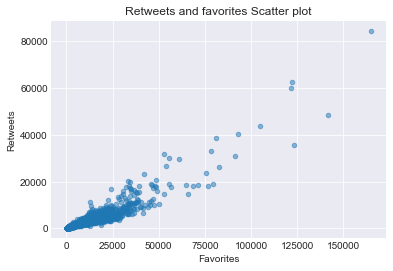
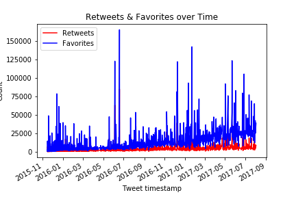

# Wrangle and Analyze WeRateDogs Twitter Data

## Introduction

In this Project, using Python and its libraries,data is gathered from a variety of sources and in a variety of formats and data wrangling is performed. After data wrangling efforts and related documenting in a Jupyter Notebook, Data is analysed and visualizations are created using Python (and its libraries) and/or SQL.

WeRateDogs Twitter [@dog_rates](https://twitter.com/dog_rates) data is used to wrangle and create interesting and trustworthy analyses and visualizations. To know more about WeRateDogs you can visit [here](https://en.wikipedia.org/wiki/WeRateDogs)

Following tasks are done as part of this project :

* Data wrangling, which consists of :
 * Gathering data
 * Assessing data
 * Cleaning data
* Storing, analyzing, and visualizing wrangled data
* Reporting on 1) data wrangling efforts and 2) data analyses and visualizations


To get started, let's import libraries


```python
#importing libraries
import pandas as pd
import numpy as np
import random
import matplotlib.pyplot as plt
import requests
import tweepy
import json
import os
import warnings
import matplotlib.dates as mdates


%matplotlib inline
```

## Gathering data

In this project we're going to gather below 3 different datasets using 3 different ways

#### 1. The WeRateDogs Twitter archive Downloaded manually : [twitter_archive_enhanced.csv](https://d17h27t6h515a5.cloudfront.net/topher/2017/August/59a4e958_twitter-archive-enhanced/twitter-archive-enhanced.csv).

This file contains basic info about tweets like tweet_id,in_reply_to_status_id,in_reply_to_user_id,timestamp,source,text,retweeted_status_id,retweeted_status_user_id,retweeted_status_timestamp,expanded_urls,rating_numerator,rating_denominator etc


```python
# Loading twitter_archive_enhanced.csv file
archive_data = pd.read_csv('twitter-archive-enhanced.csv')
archive_data.head()
```


<div>
<style scoped>
    .dataframe tbody tr th:only-of-type {
        vertical-align: middle;
    }

    .dataframe tbody tr th {
        vertical-align: top;
    }

    .dataframe thead th {
        text-align: right;
    }
</style>
<table border="1" class="dataframe">
  <thead>
    <tr style="text-align: right;">
      <th></th>
      <th>tweet_id</th>
      <th>in_reply_to_status_id</th>
      <th>in_reply_to_user_id</th>
      <th>timestamp</th>
      <th>source</th>
      <th>text</th>
      <th>retweeted_status_id</th>
      <th>retweeted_status_user_id</th>
      <th>retweeted_status_timestamp</th>
      <th>expanded_urls</th>
      <th>rating_numerator</th>
      <th>rating_denominator</th>
      <th>name</th>
      <th>doggo</th>
      <th>floofer</th>
      <th>pupper</th>
      <th>puppo</th>
    </tr>
  </thead>
  <tbody>
    <tr>
      <th>0</th>
      <td>892420643555336193</td>
      <td>NaN</td>
      <td>NaN</td>
      <td>2017-08-01 16:23:56 +0000</td>
      <td>&lt;a href="http://twitter.com/download/iphone" r...</td>
      <td>This is Phineas. He's a mystical boy. Only eve...</td>
      <td>NaN</td>
      <td>NaN</td>
      <td>NaN</td>
      <td>https://twitter.com/dog_rates/status/892420643...</td>
      <td>13</td>
      <td>10</td>
      <td>Phineas</td>
      <td>None</td>
      <td>None</td>
      <td>None</td>
      <td>None</td>
    </tr>
    <tr>
      <th>1</th>
      <td>892177421306343426</td>
      <td>NaN</td>
      <td>NaN</td>
      <td>2017-08-01 00:17:27 +0000</td>
      <td>&lt;a href="http://twitter.com/download/iphone" r...</td>
      <td>This is Tilly. She's just checking pup on you....</td>
      <td>NaN</td>
      <td>NaN</td>
      <td>NaN</td>
      <td>https://twitter.com/dog_rates/status/892177421...</td>
      <td>13</td>
      <td>10</td>
      <td>Tilly</td>
      <td>None</td>
      <td>None</td>
      <td>None</td>
      <td>None</td>
    </tr>
    <tr>
      <th>2</th>
      <td>891815181378084864</td>
      <td>NaN</td>
      <td>NaN</td>
      <td>2017-07-31 00:18:03 +0000</td>
      <td>&lt;a href="http://twitter.com/download/iphone" r...</td>
      <td>This is Archie. He is a rare Norwegian Pouncin...</td>
      <td>NaN</td>
      <td>NaN</td>
      <td>NaN</td>
      <td>https://twitter.com/dog_rates/status/891815181...</td>
      <td>12</td>
      <td>10</td>
      <td>Archie</td>
      <td>None</td>
      <td>None</td>
      <td>None</td>
      <td>None</td>
    </tr>
    <tr>
      <th>3</th>
      <td>891689557279858688</td>
      <td>NaN</td>
      <td>NaN</td>
      <td>2017-07-30 15:58:51 +0000</td>
      <td>&lt;a href="http://twitter.com/download/iphone" r...</td>
      <td>This is Darla. She commenced a snooze mid meal...</td>
      <td>NaN</td>
      <td>NaN</td>
      <td>NaN</td>
      <td>https://twitter.com/dog_rates/status/891689557...</td>
      <td>13</td>
      <td>10</td>
      <td>Darla</td>
      <td>None</td>
      <td>None</td>
      <td>None</td>
      <td>None</td>
    </tr>
    <tr>
      <th>4</th>
      <td>891327558926688256</td>
      <td>NaN</td>
      <td>NaN</td>
      <td>2017-07-29 16:00:24 +0000</td>
      <td>&lt;a href="http://twitter.com/download/iphone" r...</td>
      <td>This is Franklin. He would like you to stop ca...</td>
      <td>NaN</td>
      <td>NaN</td>
      <td>NaN</td>
      <td>https://twitter.com/dog_rates/status/891327558...</td>
      <td>12</td>
      <td>10</td>
      <td>Franklin</td>
      <td>None</td>
      <td>None</td>
      <td>None</td>
      <td>None</td>
    </tr>
  </tbody>
</table>
</div>


#### 2. [image_predictions.tsv](https://d17h27t6h515a5.cloudfront.net/topher/2017/August/599fd2ad_image-predictions/image-predictions.tsv) is downloaded programmatically using the Requests library of python.

This file contains data about tweet image predictions.


```python
#Download image_predictions.tsv file using Requests
url = 'https://d17h27t6h515a5.cloudfront.net/topher/2017/August/599fd2ad_image-predictions/image-predictions.tsv'
response_obj = requests.get(url)

# raise for any exceptions  
response_obj.raise_for_status()

# Write response object to image-predictions.tsv file
with open('image-predictions.tsv', 'wb') as file:
        file.write(response_obj.content)

# Load image-predictions.tsv file
image_data = pd.read_csv('image-predictions.tsv',sep='\t')
image_data.head()

```


<div>
<style scoped>
    .dataframe tbody tr th:only-of-type {
        vertical-align: middle;
    }

    .dataframe tbody tr th {
        vertical-align: top;
    }

    .dataframe thead th {
        text-align: right;
    }
</style>
<table border="1" class="dataframe">
  <thead>
    <tr style="text-align: right;">
      <th></th>
      <th>tweet_id</th>
      <th>jpg_url</th>
      <th>img_num</th>
      <th>p1</th>
      <th>p1_conf</th>
      <th>p1_dog</th>
      <th>p2</th>
      <th>p2_conf</th>
      <th>p2_dog</th>
      <th>p3</th>
      <th>p3_conf</th>
      <th>p3_dog</th>
    </tr>
  </thead>
  <tbody>
    <tr>
      <th>0</th>
      <td>666020888022790149</td>
      <td>https://pbs.twimg.com/media/CT4udn0WwAA0aMy.jpg</td>
      <td>1</td>
      <td>Welsh_springer_spaniel</td>
      <td>0.465074</td>
      <td>True</td>
      <td>collie</td>
      <td>0.156665</td>
      <td>True</td>
      <td>Shetland_sheepdog</td>
      <td>0.061428</td>
      <td>True</td>
    </tr>
    <tr>
      <th>1</th>
      <td>666029285002620928</td>
      <td>https://pbs.twimg.com/media/CT42GRgUYAA5iDo.jpg</td>
      <td>1</td>
      <td>redbone</td>
      <td>0.506826</td>
      <td>True</td>
      <td>miniature_pinscher</td>
      <td>0.074192</td>
      <td>True</td>
      <td>Rhodesian_ridgeback</td>
      <td>0.072010</td>
      <td>True</td>
    </tr>
    <tr>
      <th>2</th>
      <td>666033412701032449</td>
      <td>https://pbs.twimg.com/media/CT4521TWwAEvMyu.jpg</td>
      <td>1</td>
      <td>German_shepherd</td>
      <td>0.596461</td>
      <td>True</td>
      <td>malinois</td>
      <td>0.138584</td>
      <td>True</td>
      <td>bloodhound</td>
      <td>0.116197</td>
      <td>True</td>
    </tr>
    <tr>
      <th>3</th>
      <td>666044226329800704</td>
      <td>https://pbs.twimg.com/media/CT5Dr8HUEAA-lEu.jpg</td>
      <td>1</td>
      <td>Rhodesian_ridgeback</td>
      <td>0.408143</td>
      <td>True</td>
      <td>redbone</td>
      <td>0.360687</td>
      <td>True</td>
      <td>miniature_pinscher</td>
      <td>0.222752</td>
      <td>True</td>
    </tr>
    <tr>
      <th>4</th>
      <td>666049248165822465</td>
      <td>https://pbs.twimg.com/media/CT5IQmsXIAAKY4A.jpg</td>
      <td>1</td>
      <td>miniature_pinscher</td>
      <td>0.560311</td>
      <td>True</td>
      <td>Rottweiler</td>
      <td>0.243682</td>
      <td>True</td>
      <td>Doberman</td>
      <td>0.154629</td>
      <td>True</td>
    </tr>
  </tbody>
</table>
</div>


#### 3. Additional tweet information using Twitter API

Last dataset is downloaded using the tweet IDs in the WeRateDogs Twitter archive and querying the Twitter API for each tweet's JSON data using Python's Tweepy library and store each tweet's entire set of JSON data in a file called tweet_json.txt file.

Each tweet's JSON data is written to its own line in tweet_json.txt. After that, tweet_json.txt file is read line by line into a pandas DataFrame with (at minimum) tweet ID, retweet count, and favorite count.

For querying the Twitter API , twitter developer account is required and tokens need to be downloaded to access API.

Note: Twitter API keys, secrets, and tokens used are not included in this project


```python
# create variables to store twitter API keys and tokens
consumer_key = ''
consumer_secret = ''
access_token = ''
access_secret = ''
```


```python
# Connection to API
auth = tweepy.OAuthHandler(consumer_key, consumer_secret)
auth.set_access_token(access_token, access_secret)
api = tweepy.API(auth, wait_on_rate_limit=True, wait_on_rate_limit_notify=True)
```


```python
# get tweet json info from API and store it to tweet_json.txt
 if not os.path.exists('tweet_json.txt'):
    with open('tweet_json.txt', 'wb') as file:
        for tweet_id in archive_info['tweet_id']:
            try:
                tweet_json = api.get_status(tweet_id, tweet_mode='extended')._json
                json.dump(tweet_json, file)
                file.write('\n')
            except:
                continue   

```


```python
# load data from tweet_json.txt to data frame
json_data = []
with open('tweet_json.txt') as file:
    for line in file:
        try:
            tweet = json.loads(line)
            json_data.append(tweet)
        except:
            continue

api_data = pd.DataFrame(json_data)
api_data.head()
```


<div>
<style scoped>
    .dataframe tbody tr th:only-of-type {
        vertical-align: middle;
    }

    .dataframe tbody tr th {
        vertical-align: top;
    }

    .dataframe thead th {
        text-align: right;
    }
</style>
<table border="1" class="dataframe">
  <thead>
    <tr style="text-align: right;">
      <th></th>
      <th>contributors</th>
      <th>coordinates</th>
      <th>created_at</th>
      <th>display_text_range</th>
      <th>entities</th>
      <th>extended_entities</th>
      <th>favorite_count</th>
      <th>favorited</th>
      <th>full_text</th>
      <th>geo</th>
      <th>...</th>
      <th>quoted_status</th>
      <th>quoted_status_id</th>
      <th>quoted_status_id_str</th>
      <th>quoted_status_permalink</th>
      <th>retweet_count</th>
      <th>retweeted</th>
      <th>retweeted_status</th>
      <th>source</th>
      <th>truncated</th>
      <th>user</th>
    </tr>
  </thead>
  <tbody>
    <tr>
      <th>0</th>
      <td>None</td>
      <td>None</td>
      <td>Tue Aug 01 16:23:56 +0000 2017</td>
      <td>[0, 85]</td>
      <td>{'hashtags': [], 'symbols': [], 'user_mentions...</td>
      <td>{'media': [{'id': 892420639486877696, 'id_str'...</td>
      <td>38395</td>
      <td>False</td>
      <td>This is Phineas. He's a mystical boy. Only eve...</td>
      <td>None</td>
      <td>...</td>
      <td>NaN</td>
      <td>NaN</td>
      <td>NaN</td>
      <td>NaN</td>
      <td>8431</td>
      <td>False</td>
      <td>NaN</td>
      <td>&lt;a href="http://twitter.com/download/iphone" r...</td>
      <td>False</td>
      <td>{'id': 4196983835, 'id_str': '4196983835', 'na...</td>
    </tr>
    <tr>
      <th>1</th>
      <td>None</td>
      <td>None</td>
      <td>Tue Aug 01 00:17:27 +0000 2017</td>
      <td>[0, 138]</td>
      <td>{'hashtags': [], 'symbols': [], 'user_mentions...</td>
      <td>{'media': [{'id': 892177413194625024, 'id_str'...</td>
      <td>32886</td>
      <td>False</td>
      <td>This is Tilly. She's just checking pup on you....</td>
      <td>None</td>
      <td>...</td>
      <td>NaN</td>
      <td>NaN</td>
      <td>NaN</td>
      <td>NaN</td>
      <td>6213</td>
      <td>False</td>
      <td>NaN</td>
      <td>&lt;a href="http://twitter.com/download/iphone" r...</td>
      <td>False</td>
      <td>{'id': 4196983835, 'id_str': '4196983835', 'na...</td>
    </tr>
    <tr>
      <th>2</th>
      <td>None</td>
      <td>None</td>
      <td>Mon Jul 31 00:18:03 +0000 2017</td>
      <td>[0, 121]</td>
      <td>{'hashtags': [], 'symbols': [], 'user_mentions...</td>
      <td>{'media': [{'id': 891815175371796480, 'id_str'...</td>
      <td>24788</td>
      <td>False</td>
      <td>This is Archie. He is a rare Norwegian Pouncin...</td>
      <td>None</td>
      <td>...</td>
      <td>NaN</td>
      <td>NaN</td>
      <td>NaN</td>
      <td>NaN</td>
      <td>4113</td>
      <td>False</td>
      <td>NaN</td>
      <td>&lt;a href="http://twitter.com/download/iphone" r...</td>
      <td>False</td>
      <td>{'id': 4196983835, 'id_str': '4196983835', 'na...</td>
    </tr>
    <tr>
      <th>3</th>
      <td>None</td>
      <td>None</td>
      <td>Sun Jul 30 15:58:51 +0000 2017</td>
      <td>[0, 79]</td>
      <td>{'hashtags': [], 'symbols': [], 'user_mentions...</td>
      <td>{'media': [{'id': 891689552724799489, 'id_str'...</td>
      <td>41726</td>
      <td>False</td>
      <td>This is Darla. She commenced a snooze mid meal...</td>
      <td>None</td>
      <td>...</td>
      <td>NaN</td>
      <td>NaN</td>
      <td>NaN</td>
      <td>NaN</td>
      <td>8561</td>
      <td>False</td>
      <td>NaN</td>
      <td>&lt;a href="http://twitter.com/download/iphone" r...</td>
      <td>False</td>
      <td>{'id': 4196983835, 'id_str': '4196983835', 'na...</td>
    </tr>
    <tr>
      <th>4</th>
      <td>None</td>
      <td>None</td>
      <td>Sat Jul 29 16:00:24 +0000 2017</td>
      <td>[0, 138]</td>
      <td>{'hashtags': [{'text': 'BarkWeek', 'indices': ...</td>
      <td>{'media': [{'id': 891327551943041024, 'id_str'...</td>
      <td>39899</td>
      <td>False</td>
      <td>This is Franklin. He would like you to stop ca...</td>
      <td>None</td>
      <td>...</td>
      <td>NaN</td>
      <td>NaN</td>
      <td>NaN</td>
      <td>NaN</td>
      <td>9287</td>
      <td>False</td>
      <td>NaN</td>
      <td>&lt;a href="http://twitter.com/download/iphone" r...</td>
      <td>False</td>
      <td>{'id': 4196983835, 'id_str': '4196983835', 'na...</td>
    </tr>
  </tbody>
</table>
<p>5 rows × 32 columns</p>
</div>


```python
# save converted df to csv file
api_data.to_csv('tweet_json.csv', encoding = 'utf-8', index=False)
```

## Data Wrangling

In this section data is read from all 3 datasets and necessary changes are made to tidy and unify data


```python
# print column names in api_info
api_data.columns
```


    Index(['contributors', 'coordinates', 'created_at', 'display_text_range',
           'entities', 'extended_entities', 'favorite_count', 'favorited',
           'full_text', 'geo', 'id', 'id_str', 'in_reply_to_screen_name',
           'in_reply_to_status_id', 'in_reply_to_status_id_str',
           'in_reply_to_user_id', 'in_reply_to_user_id_str', 'is_quote_status',
           'lang', 'place', 'possibly_sensitive', 'possibly_sensitive_appealable',
           'quoted_status', 'quoted_status_id', 'quoted_status_id_str',
           'quoted_status_permalink', 'retweet_count', 'retweeted',
           'retweeted_status', 'source', 'truncated', 'user'],
          dtype='object')


```python
# twitter archive data
archive_data.info()
archive_data.head()
```

    <class 'pandas.core.frame.DataFrame'>
    RangeIndex: 2356 entries, 0 to 2355
    Data columns (total 17 columns):
    tweet_id                      2356 non-null int64
    in_reply_to_status_id         78 non-null float64
    in_reply_to_user_id           78 non-null float64
    timestamp                     2356 non-null object
    source                        2356 non-null object
    text                          2356 non-null object
    retweeted_status_id           181 non-null float64
    retweeted_status_user_id      181 non-null float64
    retweeted_status_timestamp    181 non-null object
    expanded_urls                 2297 non-null object
    rating_numerator              2356 non-null int64
    rating_denominator            2356 non-null int64
    name                          2356 non-null object
    doggo                         2356 non-null object
    floofer                       2356 non-null object
    pupper                        2356 non-null object
    puppo                         2356 non-null object
    dtypes: float64(4), int64(3), object(10)
    memory usage: 313.0+ KB


<div>
<style scoped>
    .dataframe tbody tr th:only-of-type {
        vertical-align: middle;
    }

    .dataframe tbody tr th {
        vertical-align: top;
    }

    .dataframe thead th {
        text-align: right;
    }
</style>
<table border="1" class="dataframe">
  <thead>
    <tr style="text-align: right;">
      <th></th>
      <th>tweet_id</th>
      <th>in_reply_to_status_id</th>
      <th>in_reply_to_user_id</th>
      <th>timestamp</th>
      <th>source</th>
      <th>text</th>
      <th>retweeted_status_id</th>
      <th>retweeted_status_user_id</th>
      <th>retweeted_status_timestamp</th>
      <th>expanded_urls</th>
      <th>rating_numerator</th>
      <th>rating_denominator</th>
      <th>name</th>
      <th>doggo</th>
      <th>floofer</th>
      <th>pupper</th>
      <th>puppo</th>
    </tr>
  </thead>
  <tbody>
    <tr>
      <th>0</th>
      <td>892420643555336193</td>
      <td>NaN</td>
      <td>NaN</td>
      <td>2017-08-01 16:23:56 +0000</td>
      <td>&lt;a href="http://twitter.com/download/iphone" r...</td>
      <td>This is Phineas. He's a mystical boy. Only eve...</td>
      <td>NaN</td>
      <td>NaN</td>
      <td>NaN</td>
      <td>https://twitter.com/dog_rates/status/892420643...</td>
      <td>13</td>
      <td>10</td>
      <td>Phineas</td>
      <td>None</td>
      <td>None</td>
      <td>None</td>
      <td>None</td>
    </tr>
    <tr>
      <th>1</th>
      <td>892177421306343426</td>
      <td>NaN</td>
      <td>NaN</td>
      <td>2017-08-01 00:17:27 +0000</td>
      <td>&lt;a href="http://twitter.com/download/iphone" r...</td>
      <td>This is Tilly. She's just checking pup on you....</td>
      <td>NaN</td>
      <td>NaN</td>
      <td>NaN</td>
      <td>https://twitter.com/dog_rates/status/892177421...</td>
      <td>13</td>
      <td>10</td>
      <td>Tilly</td>
      <td>None</td>
      <td>None</td>
      <td>None</td>
      <td>None</td>
    </tr>
    <tr>
      <th>2</th>
      <td>891815181378084864</td>
      <td>NaN</td>
      <td>NaN</td>
      <td>2017-07-31 00:18:03 +0000</td>
      <td>&lt;a href="http://twitter.com/download/iphone" r...</td>
      <td>This is Archie. He is a rare Norwegian Pouncin...</td>
      <td>NaN</td>
      <td>NaN</td>
      <td>NaN</td>
      <td>https://twitter.com/dog_rates/status/891815181...</td>
      <td>12</td>
      <td>10</td>
      <td>Archie</td>
      <td>None</td>
      <td>None</td>
      <td>None</td>
      <td>None</td>
    </tr>
    <tr>
      <th>3</th>
      <td>891689557279858688</td>
      <td>NaN</td>
      <td>NaN</td>
      <td>2017-07-30 15:58:51 +0000</td>
      <td>&lt;a href="http://twitter.com/download/iphone" r...</td>
      <td>This is Darla. She commenced a snooze mid meal...</td>
      <td>NaN</td>
      <td>NaN</td>
      <td>NaN</td>
      <td>https://twitter.com/dog_rates/status/891689557...</td>
      <td>13</td>
      <td>10</td>
      <td>Darla</td>
      <td>None</td>
      <td>None</td>
      <td>None</td>
      <td>None</td>
    </tr>
    <tr>
      <th>4</th>
      <td>891327558926688256</td>
      <td>NaN</td>
      <td>NaN</td>
      <td>2017-07-29 16:00:24 +0000</td>
      <td>&lt;a href="http://twitter.com/download/iphone" r...</td>
      <td>This is Franklin. He would like you to stop ca...</td>
      <td>NaN</td>
      <td>NaN</td>
      <td>NaN</td>
      <td>https://twitter.com/dog_rates/status/891327558...</td>
      <td>12</td>
      <td>10</td>
      <td>Franklin</td>
      <td>None</td>
      <td>None</td>
      <td>None</td>
      <td>None</td>
    </tr>
  </tbody>
</table>
</div>


```python
archive_data['doggo'].value_counts()
```


    None     2259
    doggo      97
    Name: doggo, dtype: int64


```python
archive_data['floofer'].value_counts()
```


    None       2346
    floofer      10
    Name: floofer, dtype: int64


```python
archive_data['pupper'].value_counts()
```


    None      2099
    pupper     257
    Name: pupper, dtype: int64


```python
archive_data['puppo'].value_counts()
```


    None     2326
    puppo      30
    Name: puppo, dtype: int64


* Total no of rows in 2356
* in_reply_to_status_id , in_reply_to_user_id , retweeted_status_id  & retweeted_status_user_id  are of type float64 instead of int64 or Object
* timestamp & retweeted_status_timestamp are of type object instead of Date
* expanded_urls has some null values. only 2297 are non-null.
* There are some null values in the data set
* There are some retweeted data, since we're calculating only for original tweets, need to remove them as well as columns related to retweets
* combine doggo,floofer,pupper,puppo to single column because altogether there are presnet only for 394 rows


```python
# check duplicates for tweet id in archive data set
archive_data.duplicated('tweet_id', keep=False).value_counts()
```


    False    2356
    dtype: int64


* No duplicate tweet id's


```python
# check rating numerator
archive_data['rating_numerator'].value_counts()
```


    12      558
    11      464
    10      461
    13      351
    9       158
    8       102
    7        55
    14       54
    5        37
    6        32
    3        19
    4        17
    1         9
    2         9
    420       2
    0         2
    15        2
    75        2
    80        1
    20        1
    24        1
    26        1
    44        1
    50        1
    60        1
    165       1
    84        1
    88        1
    144       1
    182       1
    143       1
    666       1
    960       1
    1776      1
    17        1
    27        1
    45        1
    99        1
    121       1
    204       1
    Name: rating_numerator, dtype: int64


```python
# check rating denominator
archive_data['rating_denominator'].value_counts()
```


    10     2333
    11        3
    50        3
    80        2
    20        2
    2         1
    16        1
    40        1
    70        1
    15        1
    90        1
    110       1
    120       1
    130       1
    150       1
    170       1
    7         1
    0         1
    Name: rating_denominator, dtype: int64


* we have different ranges and counts for numerator & denominator
* need to remove denominator with 0


```python
# image predictions data
image_data.info()
image_data.head()
```

    <class 'pandas.core.frame.DataFrame'>
    RangeIndex: 2075 entries, 0 to 2074
    Data columns (total 12 columns):
    tweet_id    2075 non-null int64
    jpg_url     2075 non-null object
    img_num     2075 non-null int64
    p1          2075 non-null object
    p1_conf     2075 non-null float64
    p1_dog      2075 non-null bool
    p2          2075 non-null object
    p2_conf     2075 non-null float64
    p2_dog      2075 non-null bool
    p3          2075 non-null object
    p3_conf     2075 non-null float64
    p3_dog      2075 non-null bool
    dtypes: bool(3), float64(3), int64(2), object(4)
    memory usage: 152.1+ KB


<div>
<style scoped>
    .dataframe tbody tr th:only-of-type {
        vertical-align: middle;
    }

    .dataframe tbody tr th {
        vertical-align: top;
    }

    .dataframe thead th {
        text-align: right;
    }
</style>
<table border="1" class="dataframe">
  <thead>
    <tr style="text-align: right;">
      <th></th>
      <th>tweet_id</th>
      <th>jpg_url</th>
      <th>img_num</th>
      <th>p1</th>
      <th>p1_conf</th>
      <th>p1_dog</th>
      <th>p2</th>
      <th>p2_conf</th>
      <th>p2_dog</th>
      <th>p3</th>
      <th>p3_conf</th>
      <th>p3_dog</th>
    </tr>
  </thead>
  <tbody>
    <tr>
      <th>0</th>
      <td>666020888022790149</td>
      <td>https://pbs.twimg.com/media/CT4udn0WwAA0aMy.jpg</td>
      <td>1</td>
      <td>Welsh_springer_spaniel</td>
      <td>0.465074</td>
      <td>True</td>
      <td>collie</td>
      <td>0.156665</td>
      <td>True</td>
      <td>Shetland_sheepdog</td>
      <td>0.061428</td>
      <td>True</td>
    </tr>
    <tr>
      <th>1</th>
      <td>666029285002620928</td>
      <td>https://pbs.twimg.com/media/CT42GRgUYAA5iDo.jpg</td>
      <td>1</td>
      <td>redbone</td>
      <td>0.506826</td>
      <td>True</td>
      <td>miniature_pinscher</td>
      <td>0.074192</td>
      <td>True</td>
      <td>Rhodesian_ridgeback</td>
      <td>0.072010</td>
      <td>True</td>
    </tr>
    <tr>
      <th>2</th>
      <td>666033412701032449</td>
      <td>https://pbs.twimg.com/media/CT4521TWwAEvMyu.jpg</td>
      <td>1</td>
      <td>German_shepherd</td>
      <td>0.596461</td>
      <td>True</td>
      <td>malinois</td>
      <td>0.138584</td>
      <td>True</td>
      <td>bloodhound</td>
      <td>0.116197</td>
      <td>True</td>
    </tr>
    <tr>
      <th>3</th>
      <td>666044226329800704</td>
      <td>https://pbs.twimg.com/media/CT5Dr8HUEAA-lEu.jpg</td>
      <td>1</td>
      <td>Rhodesian_ridgeback</td>
      <td>0.408143</td>
      <td>True</td>
      <td>redbone</td>
      <td>0.360687</td>
      <td>True</td>
      <td>miniature_pinscher</td>
      <td>0.222752</td>
      <td>True</td>
    </tr>
    <tr>
      <th>4</th>
      <td>666049248165822465</td>
      <td>https://pbs.twimg.com/media/CT5IQmsXIAAKY4A.jpg</td>
      <td>1</td>
      <td>miniature_pinscher</td>
      <td>0.560311</td>
      <td>True</td>
      <td>Rottweiler</td>
      <td>0.243682</td>
      <td>True</td>
      <td>Doberman</td>
      <td>0.154629</td>
      <td>True</td>
    </tr>
  </tbody>
</table>
</div>


* Number of rows in image predictions is 2074 whereas in archive it's 2356
* Some tweets in archive maybe missing from image prediction dataset


```python
# check duplicates for tweet id in image prediction data set
image_data.duplicated('tweet_id', keep=False).value_counts()
```


    False    2075
    dtype: int64


* There are no duplicate tweet id's


```python
# check duplicates for image url's in image prediction dataset
image_data.duplicated('jpg_url', keep=False).value_counts()
```


    False    1943
    True      132
    dtype: int64


* There are duplicate image url's in image_data


```python
# check p1_dog value counts
image_data['p1_dog'].value_counts()
```


    True     1532
    False     543
    Name: p1_dog, dtype: int64


```python
# check p2_dog value counts
image_data['p2_dog'].value_counts()
```


    True     1553
    False     522
    Name: p2_dog, dtype: int64


```python
# check p3_dog value counts
image_data['p3_dog'].value_counts()
```


    True     1499
    False     576
    Name: p3_dog, dtype: int64


```python
# api data
api_data.info()
api_data.head()
```

    <class 'pandas.core.frame.DataFrame'>
    RangeIndex: 2340 entries, 0 to 2339
    Data columns (total 32 columns):
    contributors                     0 non-null object
    coordinates                      0 non-null object
    created_at                       2340 non-null object
    display_text_range               2340 non-null object
    entities                         2340 non-null object
    extended_entities                2066 non-null object
    favorite_count                   2340 non-null int64
    favorited                        2340 non-null bool
    full_text                        2340 non-null object
    geo                              0 non-null object
    id                               2340 non-null int64
    id_str                           2340 non-null object
    in_reply_to_screen_name          78 non-null object
    in_reply_to_status_id            78 non-null float64
    in_reply_to_status_id_str        78 non-null object
    in_reply_to_user_id              78 non-null float64
    in_reply_to_user_id_str          78 non-null object
    is_quote_status                  2340 non-null bool
    lang                             2340 non-null object
    place                            1 non-null object
    possibly_sensitive               2204 non-null object
    possibly_sensitive_appealable    2204 non-null object
    quoted_status                    24 non-null object
    quoted_status_id                 26 non-null float64
    quoted_status_id_str             26 non-null object
    quoted_status_permalink          26 non-null object
    retweet_count                    2340 non-null int64
    retweeted                        2340 non-null bool
    retweeted_status                 167 non-null object
    source                           2340 non-null object
    truncated                        2340 non-null bool
    user                             2340 non-null object
    dtypes: bool(4), float64(3), int64(3), object(22)
    memory usage: 521.1+ KB


<div>
<style scoped>
    .dataframe tbody tr th:only-of-type {
        vertical-align: middle;
    }

    .dataframe tbody tr th {
        vertical-align: top;
    }

    .dataframe thead th {
        text-align: right;
    }
</style>
<table border="1" class="dataframe">
  <thead>
    <tr style="text-align: right;">
      <th></th>
      <th>contributors</th>
      <th>coordinates</th>
      <th>created_at</th>
      <th>display_text_range</th>
      <th>entities</th>
      <th>extended_entities</th>
      <th>favorite_count</th>
      <th>favorited</th>
      <th>full_text</th>
      <th>geo</th>
      <th>...</th>
      <th>quoted_status</th>
      <th>quoted_status_id</th>
      <th>quoted_status_id_str</th>
      <th>quoted_status_permalink</th>
      <th>retweet_count</th>
      <th>retweeted</th>
      <th>retweeted_status</th>
      <th>source</th>
      <th>truncated</th>
      <th>user</th>
    </tr>
  </thead>
  <tbody>
    <tr>
      <th>0</th>
      <td>None</td>
      <td>None</td>
      <td>Tue Aug 01 16:23:56 +0000 2017</td>
      <td>[0, 85]</td>
      <td>{'hashtags': [], 'symbols': [], 'user_mentions...</td>
      <td>{'media': [{'id': 892420639486877696, 'id_str'...</td>
      <td>38395</td>
      <td>False</td>
      <td>This is Phineas. He's a mystical boy. Only eve...</td>
      <td>None</td>
      <td>...</td>
      <td>NaN</td>
      <td>NaN</td>
      <td>NaN</td>
      <td>NaN</td>
      <td>8431</td>
      <td>False</td>
      <td>NaN</td>
      <td>&lt;a href="http://twitter.com/download/iphone" r...</td>
      <td>False</td>
      <td>{'id': 4196983835, 'id_str': '4196983835', 'na...</td>
    </tr>
    <tr>
      <th>1</th>
      <td>None</td>
      <td>None</td>
      <td>Tue Aug 01 00:17:27 +0000 2017</td>
      <td>[0, 138]</td>
      <td>{'hashtags': [], 'symbols': [], 'user_mentions...</td>
      <td>{'media': [{'id': 892177413194625024, 'id_str'...</td>
      <td>32886</td>
      <td>False</td>
      <td>This is Tilly. She's just checking pup on you....</td>
      <td>None</td>
      <td>...</td>
      <td>NaN</td>
      <td>NaN</td>
      <td>NaN</td>
      <td>NaN</td>
      <td>6213</td>
      <td>False</td>
      <td>NaN</td>
      <td>&lt;a href="http://twitter.com/download/iphone" r...</td>
      <td>False</td>
      <td>{'id': 4196983835, 'id_str': '4196983835', 'na...</td>
    </tr>
    <tr>
      <th>2</th>
      <td>None</td>
      <td>None</td>
      <td>Mon Jul 31 00:18:03 +0000 2017</td>
      <td>[0, 121]</td>
      <td>{'hashtags': [], 'symbols': [], 'user_mentions...</td>
      <td>{'media': [{'id': 891815175371796480, 'id_str'...</td>
      <td>24788</td>
      <td>False</td>
      <td>This is Archie. He is a rare Norwegian Pouncin...</td>
      <td>None</td>
      <td>...</td>
      <td>NaN</td>
      <td>NaN</td>
      <td>NaN</td>
      <td>NaN</td>
      <td>4113</td>
      <td>False</td>
      <td>NaN</td>
      <td>&lt;a href="http://twitter.com/download/iphone" r...</td>
      <td>False</td>
      <td>{'id': 4196983835, 'id_str': '4196983835', 'na...</td>
    </tr>
    <tr>
      <th>3</th>
      <td>None</td>
      <td>None</td>
      <td>Sun Jul 30 15:58:51 +0000 2017</td>
      <td>[0, 79]</td>
      <td>{'hashtags': [], 'symbols': [], 'user_mentions...</td>
      <td>{'media': [{'id': 891689552724799489, 'id_str'...</td>
      <td>41726</td>
      <td>False</td>
      <td>This is Darla. She commenced a snooze mid meal...</td>
      <td>None</td>
      <td>...</td>
      <td>NaN</td>
      <td>NaN</td>
      <td>NaN</td>
      <td>NaN</td>
      <td>8561</td>
      <td>False</td>
      <td>NaN</td>
      <td>&lt;a href="http://twitter.com/download/iphone" r...</td>
      <td>False</td>
      <td>{'id': 4196983835, 'id_str': '4196983835', 'na...</td>
    </tr>
    <tr>
      <th>4</th>
      <td>None</td>
      <td>None</td>
      <td>Sat Jul 29 16:00:24 +0000 2017</td>
      <td>[0, 138]</td>
      <td>{'hashtags': [{'text': 'BarkWeek', 'indices': ...</td>
      <td>{'media': [{'id': 891327551943041024, 'id_str'...</td>
      <td>39899</td>
      <td>False</td>
      <td>This is Franklin. He would like you to stop ca...</td>
      <td>None</td>
      <td>...</td>
      <td>NaN</td>
      <td>NaN</td>
      <td>NaN</td>
      <td>NaN</td>
      <td>9287</td>
      <td>False</td>
      <td>NaN</td>
      <td>&lt;a href="http://twitter.com/download/iphone" r...</td>
      <td>False</td>
      <td>{'id': 4196983835, 'id_str': '4196983835', 'na...</td>
    </tr>
  </tbody>
</table>
<p>5 rows × 32 columns</p>
</div>


* In API dataset we have only 2340 rows
* 'id' column should be renamed to 'tweet_id' so that it can be merged with other data sets.


```python
# check duplicates for id's in api dataset
api_data.duplicated('id', keep=False).value_counts()
```


    False    2340
    dtype: int64


## Clean data

#### quality issues
Archive Data:
* Remove retweets in th dataset because we're looking only for original tweets
* Same goes for response tweets as well, as they are not considered for rating
* convert timestamp is of data type object instead of Date. This needs to be formatted.
* expanded_urls has some null values. only 2297 are non-null.
* merge columns related to dog prediction and confidence level for easy readability.
* remove columns in_reply_to_status_id , in_reply_to_user_id , retweeted_status_id  & retweeted_status_user_id in archive_data(Twitter Archive dataset)
* Remove any other columns which are not signifficant for analysis
* Making columns names more readable

Image Prediction Data:
* remove rows with duplicate jpg_url value

API Data:
* rename column 'id' to 'tweet_id' in api_data(Twitter API dataset)
* api_data has 2340 rows compared to archive_data(2356) and image_data(2075), make data uniform across all datasets using tweet_id as key
* change tweet_id data type to string, as no numerical calculations are going to be performed on it

#### tidiness issues
* combine doggo,floofer,pupper,puppo columns to single column because altogether there are present only for 394 rows
* remove image_num column from image_data(Image Prediction dataset)
* Merge archive_data,image_data & api_data


```python
# make copies of existing 3 data sets
archive_data_clean = archive_data.copy()
image_data_clean = image_data.copy()
api_data_clean = api_data.copy()
```

#### Define

Remove unnecessary columns in Twitter API data set


```python
api_data_clean.columns
```


    Index(['contributors', 'coordinates', 'created_at', 'display_text_range',
           'entities', 'extended_entities', 'favorite_count', 'favorited',
           'full_text', 'geo', 'id', 'id_str', 'in_reply_to_screen_name',
           'in_reply_to_status_id', 'in_reply_to_status_id_str',
           'in_reply_to_user_id', 'in_reply_to_user_id_str', 'is_quote_status',
           'lang', 'place', 'possibly_sensitive', 'possibly_sensitive_appealable',
           'quoted_status', 'quoted_status_id', 'quoted_status_id_str',
           'quoted_status_permalink', 'retweet_count', 'retweeted',
           'retweeted_status', 'source', 'truncated', 'user'],
          dtype='object')


#### Code


```python
# remove unnecessary columns from api data
api_data_clean = api_data_clean[['id', 'favorite_count','retweet_count']]
```

#### Test


```python
api_data_clean.info()
```

    <class 'pandas.core.frame.DataFrame'>
    RangeIndex: 2340 entries, 0 to 2339
    Data columns (total 3 columns):
    id                2340 non-null int64
    favorite_count    2340 non-null int64
    retweet_count     2340 non-null int64
    dtypes: int64(3)
    memory usage: 54.9 KB


#### Define

Rename id to tweet_id in Twitter API dataset


```python
api_data_clean.info()
```

    <class 'pandas.core.frame.DataFrame'>
    RangeIndex: 2340 entries, 0 to 2339
    Data columns (total 3 columns):
    id                2340 non-null int64
    favorite_count    2340 non-null int64
    retweet_count     2340 non-null int64
    dtypes: int64(3)
    memory usage: 54.9 KB


#### Code


```python
api_data_clean.rename(columns={'id': 'tweet_id'}, inplace=True)
```

#### Test


```python
api_data_clean.info()
```

    <class 'pandas.core.frame.DataFrame'>
    RangeIndex: 2340 entries, 0 to 2339
    Data columns (total 3 columns):
    tweet_id          2340 non-null int64
    favorite_count    2340 non-null int64
    retweet_count     2340 non-null int64
    dtypes: int64(3)
    memory usage: 54.9 KB


#### Define

merge twitter archive data , image prediction data and data from Twitter API

#### Code


```python
# merge archive data set to api data set using tweet_id & id of respective datasets
archive_data_clean = pd.merge(archive_data_clean, api_data_clean,on='tweet_id', how='inner')
# merge archive data set and image perdiction state using common column tweet_id
archive_data_clean = pd.merge(archive_data_clean, image_data_clean,on='tweet_id', how='inner')
```

#### Test


```python
archive_data_clean.info()
```

    <class 'pandas.core.frame.DataFrame'>
    Int64Index: 2066 entries, 0 to 2065
    Data columns (total 30 columns):
    tweet_id                      2066 non-null int64
    in_reply_to_status_id         23 non-null float64
    in_reply_to_user_id           23 non-null float64
    timestamp                     2066 non-null object
    source                        2066 non-null object
    text                          2066 non-null object
    retweeted_status_id           74 non-null float64
    retweeted_status_user_id      74 non-null float64
    retweeted_status_timestamp    74 non-null object
    expanded_urls                 2066 non-null object
    rating_numerator              2066 non-null int64
    rating_denominator            2066 non-null int64
    name                          2066 non-null object
    doggo                         2066 non-null object
    floofer                       2066 non-null object
    pupper                        2066 non-null object
    puppo                         2066 non-null object
    favorite_count                2066 non-null int64
    retweet_count                 2066 non-null int64
    jpg_url                       2066 non-null object
    img_num                       2066 non-null int64
    p1                            2066 non-null object
    p1_conf                       2066 non-null float64
    p1_dog                        2066 non-null bool
    p2                            2066 non-null object
    p2_conf                       2066 non-null float64
    p2_dog                        2066 non-null bool
    p3                            2066 non-null object
    p3_conf                       2066 non-null float64
    p3_dog                        2066 non-null bool
    dtypes: bool(3), float64(7), int64(6), object(14)
    memory usage: 458.0+ KB


####  Define
combine doggo,floofer,pupper,puppo columns in archive_data to single column dog_stage


```python
archive_data_clean.columns
```


    Index(['tweet_id', 'in_reply_to_status_id', 'in_reply_to_user_id', 'timestamp',
           'source', 'text', 'retweeted_status_id', 'retweeted_status_user_id',
           'retweeted_status_timestamp', 'expanded_urls', 'rating_numerator',
           'rating_denominator', 'name', 'doggo', 'floofer', 'pupper', 'puppo',
           'favorite_count', 'retweet_count', 'jpg_url', 'img_num', 'p1',
           'p1_conf', 'p1_dog', 'p2', 'p2_conf', 'p2_dog', 'p3', 'p3_conf',
           'p3_dog'],
          dtype='object')


#### Code


```python
# merge columns doggo,floofer,pupper,puppo
archive_data_clean['dog_type'] = archive_data_clean[['doggo', 'floofer','pupper','puppo']].apply(lambda x: ''.join(x), axis=1)
archive_data_clean['dog_type'].replace("NoneNoneNoneNone","None ", inplace=True)
archive_data_clean['dog_type'].replace("doggoNoneNoneNone","doggo", inplace=True)
archive_data_clean['dog_type'].replace("NoneflooferNoneNone","floofer", inplace=True)
archive_data_clean['dog_type'].replace("NoneNonepupperNone","pupper", inplace=True)
archive_data_clean['dog_type'].replace("NoneNoneNonepuppo","puppo", inplace=True)
# remove columns
archive_data_clean.drop(['doggo', 'floofer', 'pupper', 'puppo'], axis=1, inplace=True)
# remove duplicates
archive_data_clean = archive_data_clean.sort_values('dog_type').drop_duplicates(subset='tweet_id', keep='last')
```

#### Test


```python
# check columns
archive_data_clean.columns
```


    Index(['tweet_id', 'in_reply_to_status_id', 'in_reply_to_user_id', 'timestamp',
           'source', 'text', 'retweeted_status_id', 'retweeted_status_user_id',
           'retweeted_status_timestamp', 'expanded_urls', 'rating_numerator',
           'rating_denominator', 'name', 'favorite_count', 'retweet_count',
           'jpg_url', 'img_num', 'p1', 'p1_conf', 'p1_dog', 'p2', 'p2_conf',
           'p2_dog', 'p3', 'p3_conf', 'p3_dog', 'dog_type'],
          dtype='object')


```python
# check value count for dog_type
archive_data_clean['dog_type'].value_counts()
```


    None                    1746
    pupper                   210
    doggo                     67
    puppo                     23
    doggoNonepupperNone       11
    floofer                    7
    doggoflooferNoneNone       1
    doggoNoneNonepuppo         1
    Name: dog_type, dtype: int64


#### Define
Remove retweets in the dataset by checking for field retweeted_status_id

#### Code


```python
# remove rows with retweets
archive_data_clean = archive_data_clean[pd.isnull(archive_data_clean['retweeted_status_id'])]
```

#### Test


```python
# check retweeted_status_user_id value count
archive_data_clean['retweeted_status_id'].value_counts()
```


    Series([], Name: retweeted_status_id, dtype: int64)


#### Define
remove tweets with no images based on field jpg_url


```python
archive_data_clean.duplicated('jpg_url', keep=False).value_counts()
```


    False    1992
    dtype: int64


#### Code


```python
# remove tweets with no images
archive_data_clean = archive_data_clean.dropna(subset = ['jpg_url'])

```

#### Test


```python
archive_data_clean.duplicated('jpg_url', keep=False).value_counts()
```


    False    1992
    dtype: int64


#### Define

remove columns related to retweets


```python
archive_data_clean.columns
```


    Index(['tweet_id', 'in_reply_to_status_id', 'in_reply_to_user_id', 'timestamp',
           'source', 'text', 'retweeted_status_id', 'retweeted_status_user_id',
           'retweeted_status_timestamp', 'expanded_urls', 'rating_numerator',
           'rating_denominator', 'name', 'favorite_count', 'retweet_count',
           'jpg_url', 'img_num', 'p1', 'p1_conf', 'p1_dog', 'p2', 'p2_conf',
           'p2_dog', 'p3', 'p3_conf', 'p3_dog', 'dog_type'],
          dtype='object')


#### Code


```python
archive_data_clean.drop(['retweeted_status_id', 'retweeted_status_user_id', 'retweeted_status_timestamp'], axis=1, inplace=True)
```

#### Test


```python
archive_data_clean.columns
```


    Index(['tweet_id', 'in_reply_to_status_id', 'in_reply_to_user_id', 'timestamp',
           'source', 'text', 'expanded_urls', 'rating_numerator',
           'rating_denominator', 'name', 'favorite_count', 'retweet_count',
           'jpg_url', 'img_num', 'p1', 'p1_conf', 'p1_dog', 'p2', 'p2_conf',
           'p2_dog', 'p3', 'p3_conf', 'p3_dog', 'dog_type'],
          dtype='object')


####  Define
Removing reply tweets using column in_reply_to_status_id


```python
archive_data_clean['in_reply_to_status_id'].value_counts()
```


    6.671522e+17    2
    8.558181e+17    1
    6.753494e+17    1
    6.747934e+17    1
    6.747522e+17    1
    7.468859e+17    1
    6.706684e+17    1
    6.844811e+17    1
    6.749998e+17    1
    6.842229e+17    1
    7.291135e+17    1
    6.754971e+17    1
    6.717299e+17    1
    6.715610e+17    1
    7.030419e+17    1
    6.757073e+17    1
    7.590995e+17    1
    6.914169e+17    1
    7.032559e+17    1
    6.678065e+17    1
    6.920419e+17    1
    7.331095e+17    1
    Name: in_reply_to_status_id, dtype: int64


#### Code


```python
# remove rows with responses
archive_data_clean = archive_data_clean[pd.isnull(archive_data_clean['in_reply_to_status_id'])]

```

#### Test


```python
archive_data_clean['in_reply_to_status_id'].value_counts()
```


    Series([], Name: in_reply_to_status_id, dtype: int64)


#### Define
Remove columns in_reply_to_status_id,in_reply_to_user_id,expanded_urls,id,img_num


```python
archive_data_clean.columns
```


    Index(['tweet_id', 'in_reply_to_status_id', 'in_reply_to_user_id', 'timestamp',
           'source', 'text', 'expanded_urls', 'rating_numerator',
           'rating_denominator', 'name', 'favorite_count', 'retweet_count',
           'jpg_url', 'img_num', 'p1', 'p1_conf', 'p1_dog', 'p2', 'p2_conf',
           'p2_dog', 'p3', 'p3_conf', 'p3_dog', 'dog_type'],
          dtype='object')


#### Code


```python
archive_data_clean.drop(['in_reply_to_status_id', 'in_reply_to_user_id', 'expanded_urls', 'img_num'], axis=1, inplace=True)
```

#### Test


```python
archive_data_clean.columns
```


    Index(['tweet_id', 'timestamp', 'source', 'text', 'rating_numerator',
           'rating_denominator', 'name', 'favorite_count', 'retweet_count',
           'jpg_url', 'p1', 'p1_conf', 'p1_dog', 'p2', 'p2_conf', 'p2_dog', 'p3',
           'p3_conf', 'p3_dog', 'dog_type'],
          dtype='object')


#### Define
Convert timestamp to datetime object


```python
archive_data_clean.info()
```

    <class 'pandas.core.frame.DataFrame'>
    Int64Index: 1969 entries, 0 to 444
    Data columns (total 20 columns):
    tweet_id              1969 non-null int64
    timestamp             1969 non-null object
    source                1969 non-null object
    text                  1969 non-null object
    rating_numerator      1969 non-null int64
    rating_denominator    1969 non-null int64
    name                  1969 non-null object
    favorite_count        1969 non-null int64
    retweet_count         1969 non-null int64
    jpg_url               1969 non-null object
    p1                    1969 non-null object
    p1_conf               1969 non-null float64
    p1_dog                1969 non-null bool
    p2                    1969 non-null object
    p2_conf               1969 non-null float64
    p2_dog                1969 non-null bool
    p3                    1969 non-null object
    p3_conf               1969 non-null float64
    p3_dog                1969 non-null bool
    dog_type              1969 non-null object
    dtypes: bool(3), float64(3), int64(5), object(9)
    memory usage: 282.7+ KB


#### Code


```python
archive_data_clean['timestamp'] = pd.to_datetime(archive_data_clean['timestamp'])
```

#### Test


```python
archive_data_clean.info()
```

    <class 'pandas.core.frame.DataFrame'>
    Int64Index: 1969 entries, 0 to 444
    Data columns (total 20 columns):
    tweet_id              1969 non-null int64
    timestamp             1969 non-null datetime64[ns]
    source                1969 non-null object
    text                  1969 non-null object
    rating_numerator      1969 non-null int64
    rating_denominator    1969 non-null int64
    name                  1969 non-null object
    favorite_count        1969 non-null int64
    retweet_count         1969 non-null int64
    jpg_url               1969 non-null object
    p1                    1969 non-null object
    p1_conf               1969 non-null float64
    p1_dog                1969 non-null bool
    p2                    1969 non-null object
    p2_conf               1969 non-null float64
    p2_dog                1969 non-null bool
    p3                    1969 non-null object
    p3_conf               1969 non-null float64
    p3_dog                1969 non-null bool
    dog_type              1969 non-null object
    dtypes: bool(3), datetime64[ns](1), float64(3), int64(5), object(8)
    memory usage: 282.7+ KB


#### Define
Convert rating numerator and denominator to float


```python
archive_data_clean.info()
```

    <class 'pandas.core.frame.DataFrame'>
    Int64Index: 1969 entries, 0 to 444
    Data columns (total 20 columns):
    tweet_id              1969 non-null int64
    timestamp             1969 non-null datetime64[ns]
    source                1969 non-null object
    text                  1969 non-null object
    rating_numerator      1969 non-null int64
    rating_denominator    1969 non-null int64
    name                  1969 non-null object
    favorite_count        1969 non-null int64
    retweet_count         1969 non-null int64
    jpg_url               1969 non-null object
    p1                    1969 non-null object
    p1_conf               1969 non-null float64
    p1_dog                1969 non-null bool
    p2                    1969 non-null object
    p2_conf               1969 non-null float64
    p2_dog                1969 non-null bool
    p3                    1969 non-null object
    p3_conf               1969 non-null float64
    p3_dog                1969 non-null bool
    dog_type              1969 non-null object
    dtypes: bool(3), datetime64[ns](1), float64(3), int64(5), object(8)
    memory usage: 282.7+ KB


#### Code


```python
archive_data_clean[['rating_numerator', 'rating_denominator']] = archive_data_clean[['rating_numerator','rating_denominator']].astype(float)

```

#### Test


```python
archive_data_clean.info()
```

    <class 'pandas.core.frame.DataFrame'>
    Int64Index: 1969 entries, 0 to 444
    Data columns (total 20 columns):
    tweet_id              1969 non-null int64
    timestamp             1969 non-null datetime64[ns]
    source                1969 non-null object
    text                  1969 non-null object
    rating_numerator      1969 non-null float64
    rating_denominator    1969 non-null float64
    name                  1969 non-null object
    favorite_count        1969 non-null int64
    retweet_count         1969 non-null int64
    jpg_url               1969 non-null object
    p1                    1969 non-null object
    p1_conf               1969 non-null float64
    p1_dog                1969 non-null bool
    p2                    1969 non-null object
    p2_conf               1969 non-null float64
    p2_dog                1969 non-null bool
    p3                    1969 non-null object
    p3_conf               1969 non-null float64
    p3_dog                1969 non-null bool
    dog_type              1969 non-null object
    dtypes: bool(3), datetime64[ns](1), float64(5), int64(3), object(8)
    memory usage: 282.7+ KB


#### Define
Create single columns for predicted_dog and confidence_level based on predictability and level of confidence


```python
archive_data_clean.columns
```


    Index(['tweet_id', 'timestamp', 'source', 'text', 'rating_numerator',
           'rating_denominator', 'name', 'favorite_count', 'retweet_count',
           'jpg_url', 'p1', 'p1_conf', 'p1_dog', 'p2', 'p2_conf', 'p2_dog', 'p3',
           'p3_conf', 'p3_dog', 'dog_type'],
          dtype='object')


#### Code


```python
# select algorithm based on it's true prediction and level of confidence
prediction_algorithm = []
confidence_level = []

def get_prediction_confidence(dataframe):

    if ( dataframe['p1_dog'] == True and dataframe['p2_dog'] == True and dataframe['p3_dog'] == True ) :
        if ( dataframe['p1_conf'] > dataframe['p2_conf'] and dataframe['p1_conf'] > dataframe['p3_conf']  ) :
            prediction_algorithm.append(dataframe['p1'])
            confidence_level.append(dataframe['p1_conf'])
        elif ( dataframe['p2_conf'] > dataframe['p1_conf'] and dataframe['p2_conf'] > dataframe['p3_conf']  ) :
            prediction_algorithm.append(dataframe['p2'])
            confidence_level.append(dataframe['p2_conf'])
        elif ( dataframe['p3_conf'] > dataframe['p1_conf'] and dataframe['p3_conf'] > dataframe['p2_conf']  ) :
            prediction_algorithm.append(dataframe['p3'])
            confidence_level.append(dataframe['p3_conf'])
    elif ( dataframe['p1_dog'] == True and dataframe['p2_dog'] == True) :
        if ( dataframe['p1_conf'] > dataframe['p2_conf'] ) :
            prediction_algorithm.append(dataframe['p1'])
            confidence_level.append(dataframe['p1_conf'])
        else:
            prediction_algorithm.append(dataframe['p2'])
            confidence_level.append(dataframe['p2_conf'])
    elif ( dataframe['p2_dog'] == True and dataframe['p3_dog'] == True) :
        if ( dataframe['p2_conf'] > dataframe['p3_conf'] ) :
            prediction_algorithm.append(dataframe['p2'])
            confidence_level.append(dataframe['p2_conf'])
        else:
            prediction_algorithm.append(dataframe['p3'])
            confidence_level.append(dataframe['p3_conf'])
    elif ( dataframe['p3_dog'] == True and dataframe['p1_dog'] == True) :
        if ( dataframe['p3_conf'] > dataframe['p1_conf'] ) :
            prediction_algorithm.append(dataframe['p3'])
            confidence_level.append(dataframe['p3_conf'])
        else:
            prediction_algorithm.append(dataframe['p1'])
            confidence_level.append(dataframe['p1_conf'])
    elif dataframe['p2_dog'] == True:
        prediction_algorithm.append(dataframe['p2'])
        confidence_level.append(dataframe['p2_conf'])
    elif dataframe['p3_dog'] == True:
        prediction_algorithm.append(dataframe['p3'])
        confidence_level.append(dataframe['p3_conf'])
    elif dataframe['p1_dog'] == True:
        prediction_algorithm.append(dataframe['p1'])
        confidence_level.append(dataframe['p1_conf'])
    elif dataframe['p2_dog'] == True:
        prediction_algorithm.append(dataframe['p2'])
        confidence_level.append(dataframe['p2_conf'])
    elif dataframe['p3_dog'] == True:
        prediction_algorithm.append(dataframe['p3'])
        confidence_level.append(dataframe['p3_conf'])
    else:
        prediction_algorithm.append('NaN')
        confidence_level.append(0)

archive_data_clean.apply(get_prediction_confidence, axis=1)
archive_data_clean['prediction_algorithm'] = prediction_algorithm
archive_data_clean['confidence_level'] = confidence_level
```

#### Test


```python
archive_data_clean['prediction_algorithm'].value_counts()
```


    NaN                            304
    golden_retriever               156
    Labrador_retriever             106
    Pembroke                        94
    Chihuahua                       90
    pug                             62
    toy_poodle                      50
    chow                            48
    Samoyed                         42
    Pomeranian                      41
    malamute                        33
    Chesapeake_Bay_retriever        31
    cocker_spaniel                  30
    French_bulldog                  30
    miniature_pinscher              24
    Eskimo_dog                      22
    German_shepherd                 21
    Cardigan                        21
    Siberian_husky                  20
    Staffordshire_bullterrier       20
    beagle                          20
    Shih-Tzu                        20
    Maltese_dog                     19
    Shetland_sheepdog               18
    Rottweiler                      18
    Italian_greyhound               17
    basset                          17
    kuvasz                          17
    Lakeland_terrier                17
    West_Highland_white_terrier     16
                                  ...
    bluetick                         4
    Rhodesian_ridgeback              4
    Irish_setter                     4
    keeshond                         4
    Scottish_deerhound               4
    Greater_Swiss_Mountain_dog       3
    Afghan_hound                     3
    curly-coated_retriever           3
    toy_terrier                      3
    cairn                            3
    Irish_water_spaniel              3
    briard                           3
    Leonberg                         3
    Brabancon_griffon                3
    giant_schnauzer                  3
    komondor                         3
    Sussex_spaniel                   2
    groenendael                      2
    Appenzeller                      2
    Australian_terrier               2
    wire-haired_fox_terrier          2
    black-and-tan_coonhound          2
    Irish_wolfhound                  1
    Bouvier_des_Flandres             1
    EntleBucher                      1
    standard_schnauzer               1
    Scotch_terrier                   1
    silky_terrier                    1
    clumber                          1
    Japanese_spaniel                 1
    Name: prediction_algorithm, Length: 114, dtype: int64


#### Define
Drop columns related to image prediction

#### Code


```python
archive_data_clean.drop(['p1' ,'p1_conf', 'p1_dog', 'p2', 'p2_conf', 'p2_dog', 'p3' ,'p3_conf', 'p3_dog' ], axis=1, inplace=True)
```

#### Test


```python
archive_data_clean.columns
```


    Index(['tweet_id', 'timestamp', 'source', 'text', 'rating_numerator',
           'rating_denominator', 'name', 'favorite_count', 'retweet_count',
           'jpg_url', 'dog_type', 'prediction_algorithm', 'confidence_level'],
          dtype='object')


#### Archive master cleaned data to File


```python
archive_data_clean.to_csv('twitter_archive_master.csv', index = False)
```

## Analysis

Print sample from clean data set


```python
archive_data_clean.sample(10)
```


<div>
<style scoped>
    .dataframe tbody tr th:only-of-type {
        vertical-align: middle;
    }

    .dataframe tbody tr th {
        vertical-align: top;
    }

    .dataframe thead th {
        text-align: right;
    }
</style>
<table border="1" class="dataframe">
  <thead>
    <tr style="text-align: right;">
      <th></th>
      <th>tweet_id</th>
      <th>timestamp</th>
      <th>source</th>
      <th>text</th>
      <th>rating_numerator</th>
      <th>rating_denominator</th>
      <th>name</th>
      <th>favorite_count</th>
      <th>retweet_count</th>
      <th>jpg_url</th>
      <th>dog_type</th>
      <th>prediction_algorithm</th>
      <th>confidence_level</th>
    </tr>
  </thead>
  <tbody>
    <tr>
      <th>350</th>
      <td>819227688460238848</td>
      <td>2017-01-11 17:01:16</td>
      <td>&lt;a href="http://twitter.com/download/iphone" r...</td>
      <td>This is Finn. He's wondering if you come here ...</td>
      <td>12.0</td>
      <td>10.0</td>
      <td>Finn</td>
      <td>24787</td>
      <td>7376</td>
      <td>https://pbs.twimg.com/media/C157Oq3WQAEOyHm.jpg</td>
      <td>None</td>
      <td>Border_terrier</td>
      <td>0.482452</td>
    </tr>
    <tr>
      <th>1207</th>
      <td>696894894812565505</td>
      <td>2016-02-09 03:14:25</td>
      <td>&lt;a href="http://twitter.com/download/iphone" r...</td>
      <td>These two pirates crashed their ship and don't...</td>
      <td>9.0</td>
      <td>10.0</td>
      <td>None</td>
      <td>2485</td>
      <td>731</td>
      <td>https://pbs.twimg.com/media/CaveNQcVIAECyBr.jpg</td>
      <td>None</td>
      <td>Appenzeller</td>
      <td>0.665628</td>
    </tr>
    <tr>
      <th>1133</th>
      <td>703356393781329922</td>
      <td>2016-02-26 23:10:06</td>
      <td>&lt;a href="http://twitter.com/download/iphone" r...</td>
      <td>This is Socks. That water pup w the super legs...</td>
      <td>9.0</td>
      <td>10.0</td>
      <td>Socks</td>
      <td>2021</td>
      <td>418</td>
      <td>https://pbs.twimg.com/media/CcLS6QKUcAAUuPa.jpg</td>
      <td>None</td>
      <td>Border_collie</td>
      <td>0.894842</td>
    </tr>
    <tr>
      <th>599</th>
      <td>779056095788752897</td>
      <td>2016-09-22 20:33:42</td>
      <td>&lt;a href="http://twitter.com/download/iphone" r...</td>
      <td>Everybody drop what you're doing and look at t...</td>
      <td>13.0</td>
      <td>10.0</td>
      <td>None</td>
      <td>15943</td>
      <td>4999</td>
      <td>https://pbs.twimg.com/media/Cs_DYr1XEAA54Pu.jpg</td>
      <td>None</td>
      <td>Chihuahua</td>
      <td>0.721188</td>
    </tr>
    <tr>
      <th>1882</th>
      <td>669354382627049472</td>
      <td>2015-11-25 03:18:15</td>
      <td>&lt;a href="http://twitter.com/download/iphone" r...</td>
      <td>Meet Dug. Dug fucken loves peaches. 8/10 https...</td>
      <td>8.0</td>
      <td>10.0</td>
      <td>Dug</td>
      <td>2782</td>
      <td>1320</td>
      <td>https://pbs.twimg.com/media/CUoGQjdXAAAkaz2.jpg</td>
      <td>None</td>
      <td>Chihuahua</td>
      <td>0.973990</td>
    </tr>
    <tr>
      <th>923</th>
      <td>730196704625098752</td>
      <td>2016-05-11 00:43:55</td>
      <td>&lt;a href="http://twitter.com/download/iphone" r...</td>
      <td>This is Charles. He's camera shy. Tail longer ...</td>
      <td>6.0</td>
      <td>10.0</td>
      <td>Charles</td>
      <td>5153</td>
      <td>2066</td>
      <td>https://pbs.twimg.com/media/CiIuBwCUgAAAGbz.jpg</td>
      <td>None</td>
      <td>NaN</td>
      <td>0.000000</td>
    </tr>
    <tr>
      <th>1949</th>
      <td>668142349051129856</td>
      <td>2015-11-21 19:02:04</td>
      <td>&lt;a href="http://twitter.com/download/iphone" r...</td>
      <td>This lil pup is Oliver. Hops around. Has wings...</td>
      <td>2.0</td>
      <td>10.0</td>
      <td>None</td>
      <td>576</td>
      <td>296</td>
      <td>https://pbs.twimg.com/media/CUW37BzWsAAlJlN.jpg</td>
      <td>None</td>
      <td>NaN</td>
      <td>0.000000</td>
    </tr>
    <tr>
      <th>816</th>
      <td>747885874273214464</td>
      <td>2016-06-28 20:14:22</td>
      <td>&lt;a href="http://twitter.com/download/iphone" r...</td>
      <td>This is a mighty rare blue-tailed hammer sherk...</td>
      <td>8.0</td>
      <td>10.0</td>
      <td>a</td>
      <td>3135</td>
      <td>1073</td>
      <td>https://pbs.twimg.com/media/CmEGMSvUYAAl3ZM.jpg</td>
      <td>None</td>
      <td>kuvasz</td>
      <td>0.408450</td>
    </tr>
    <tr>
      <th>2055</th>
      <td>666063827256086533</td>
      <td>2015-11-16 01:22:45</td>
      <td>&lt;a href="http://twitter.com/download/iphone" r...</td>
      <td>This is the happiest dog you will ever see. Ve...</td>
      <td>10.0</td>
      <td>10.0</td>
      <td>the</td>
      <td>471</td>
      <td>216</td>
      <td>https://pbs.twimg.com/media/CT5Vg_wXIAAXfnj.jpg</td>
      <td>None</td>
      <td>golden_retriever</td>
      <td>0.775930</td>
    </tr>
    <tr>
      <th>904</th>
      <td>734912297295085568</td>
      <td>2016-05-24 01:02:00</td>
      <td>&lt;a href="http://twitter.com/download/iphone" r...</td>
      <td>This is Jax. He's a literal fluffball. Sneaky ...</td>
      <td>10.0</td>
      <td>10.0</td>
      <td>Jax</td>
      <td>2891</td>
      <td>556</td>
      <td>https://pbs.twimg.com/media/CjLuzPvUoAAbU5k.jpg</td>
      <td>None</td>
      <td>Maltese_dog</td>
      <td>0.847292</td>
    </tr>
  </tbody>
</table>
</div>


#### Most Favorite tweet


```python
archive_data_clean.sort_values('favorite_count', ascending=False)[['tweet_id','favorite_count']].head()
```


<div>
<style scoped>
    .dataframe tbody tr th:only-of-type {
        vertical-align: middle;
    }

    .dataframe tbody tr th {
        vertical-align: top;
    }

    .dataframe thead th {
        text-align: right;
    }
</style>
<table border="1" class="dataframe">
  <thead>
    <tr style="text-align: right;">
      <th></th>
      <th>tweet_id</th>
      <th>favorite_count</th>
    </tr>
  </thead>
  <tbody>
    <tr>
      <th>845</th>
      <td>744234799360020481</td>
      <td>164884</td>
    </tr>
    <tr>
      <th>325</th>
      <td>822872901745569793</td>
      <td>141718</td>
    </tr>
    <tr>
      <th>111</th>
      <td>866450705531457537</td>
      <td>123015</td>
    </tr>
    <tr>
      <th>880</th>
      <td>739238157791694849</td>
      <td>122315</td>
    </tr>
    <tr>
      <th>428</th>
      <td>807106840509214720</td>
      <td>121609</td>
    </tr>
  </tbody>
</table>
</div>


```python
# get row details for Most favorite tweet
pd.set_option('display.max_colwidth', -1)
archive_data_clean.loc[archive_data_clean['tweet_id'] == 744234799360020481]
```


<div>
<style scoped>
    .dataframe tbody tr th:only-of-type {
        vertical-align: middle;
    }

    .dataframe tbody tr th {
        vertical-align: top;
    }

    .dataframe thead th {
        text-align: right;
    }
</style>
<table border="1" class="dataframe">
  <thead>
    <tr style="text-align: right;">
      <th></th>
      <th>tweet_id</th>
      <th>timestamp</th>
      <th>source</th>
      <th>text</th>
      <th>rating_numerator</th>
      <th>rating_denominator</th>
      <th>name</th>
      <th>favorite_count</th>
      <th>retweet_count</th>
      <th>jpg_url</th>
      <th>dog_type</th>
      <th>prediction_algorithm</th>
      <th>confidence_level</th>
    </tr>
  </thead>
  <tbody>
    <tr>
      <th>845</th>
      <td>744234799360020481</td>
      <td>2016-06-18 18:26:18</td>
      <td>&lt;a href="http://twitter.com/download/iphone" rel="nofollow"&gt;Twitter for iPhone&lt;/a&gt;</td>
      <td>Here's a doggo realizing you can stand in a pool. 13/10 enlightened af (vid by Tina Conrad) https://t.co/7wE9LTEXC4</td>
      <td>13.0</td>
      <td>10.0</td>
      <td>None</td>
      <td>164884</td>
      <td>84502</td>
      <td>https://pbs.twimg.com/ext_tw_video_thumb/744234667679821824/pu/img/1GaWmtJtdqzZV7jy.jpg</td>
      <td>doggo</td>
      <td>Labrador_retriever</td>
      <td>0.825333</td>
    </tr>
  </tbody>
</table>
</div>


#### Least favorite tweet


```python
archive_data_clean.sort_values('favorite_count', ascending=True)[['tweet_id','favorite_count']].head()
```


<div>
<style scoped>
    .dataframe tbody tr th:only-of-type {
        vertical-align: middle;
    }

    .dataframe tbody tr th {
        vertical-align: top;
    }

    .dataframe thead th {
        text-align: right;
    }
</style>
<table border="1" class="dataframe">
  <thead>
    <tr style="text-align: right;">
      <th></th>
      <th>tweet_id</th>
      <th>favorite_count</th>
    </tr>
  </thead>
  <tbody>
    <tr>
      <th>2049</th>
      <td>666102155909144576</td>
      <td>80</td>
    </tr>
    <tr>
      <th>2047</th>
      <td>666268910803644416</td>
      <td>102</td>
    </tr>
    <tr>
      <th>2030</th>
      <td>666447344410484738</td>
      <td>105</td>
    </tr>
    <tr>
      <th>2037</th>
      <td>666407126856765440</td>
      <td>108</td>
    </tr>
    <tr>
      <th>2061</th>
      <td>666049248165822465</td>
      <td>109</td>
    </tr>
  </tbody>
</table>
</div>


```python
# get row details for least favorite tweet
pd.set_option('display.max_colwidth', -1)
archive_data_clean.loc[archive_data_clean['tweet_id'] == 666102155909144576]
```


<div>
<style scoped>
    .dataframe tbody tr th:only-of-type {
        vertical-align: middle;
    }

    .dataframe tbody tr th {
        vertical-align: top;
    }

    .dataframe thead th {
        text-align: right;
    }
</style>
<table border="1" class="dataframe">
  <thead>
    <tr style="text-align: right;">
      <th></th>
      <th>tweet_id</th>
      <th>timestamp</th>
      <th>source</th>
      <th>text</th>
      <th>rating_numerator</th>
      <th>rating_denominator</th>
      <th>name</th>
      <th>favorite_count</th>
      <th>retweet_count</th>
      <th>jpg_url</th>
      <th>dog_type</th>
      <th>prediction_algorithm</th>
      <th>confidence_level</th>
    </tr>
  </thead>
  <tbody>
    <tr>
      <th>2049</th>
      <td>666102155909144576</td>
      <td>2015-11-16 03:55:04</td>
      <td>&lt;a href="http://twitter.com/download/iphone" rel="nofollow"&gt;Twitter for iPhone&lt;/a&gt;</td>
      <td>Oh my. Here you are seeing an Adobe Setter giving birth to twins!!! The world is an amazing place. 11/10 https://t.co/11LvqN4WLq</td>
      <td>11.0</td>
      <td>10.0</td>
      <td>None</td>
      <td>80</td>
      <td>12</td>
      <td>https://pbs.twimg.com/media/CT54YGiWUAEZnoK.jpg</td>
      <td>None</td>
      <td>English_setter</td>
      <td>0.298617</td>
    </tr>
  </tbody>
</table>
</div>


#### Highest retweeted tweet


```python
archive_data_clean.sort_values('retweet_count', ascending=False)[['tweet_id','retweet_count']].head()
```


<div>
<style scoped>
    .dataframe tbody tr th:only-of-type {
        vertical-align: middle;
    }

    .dataframe tbody tr th {
        vertical-align: top;
    }

    .dataframe thead th {
        text-align: right;
    }
</style>
<table border="1" class="dataframe">
  <thead>
    <tr style="text-align: right;">
      <th></th>
      <th>tweet_id</th>
      <th>retweet_count</th>
    </tr>
  </thead>
  <tbody>
    <tr>
      <th>845</th>
      <td>744234799360020481</td>
      <td>84502</td>
    </tr>
    <tr>
      <th>880</th>
      <td>739238157791694849</td>
      <td>62719</td>
    </tr>
    <tr>
      <th>428</th>
      <td>807106840509214720</td>
      <td>60166</td>
    </tr>
    <tr>
      <th>325</th>
      <td>822872901745569793</td>
      <td>48315</td>
    </tr>
    <tr>
      <th>59</th>
      <td>879415818425184262</td>
      <td>43881</td>
    </tr>
  </tbody>
</table>
</div>


```python
# get row details for Highest retweeted tweet
pd.set_option('display.max_colwidth', -1)
archive_data_clean.loc[archive_data_clean['tweet_id'] == 744234799360020481]
```


<div>
<style scoped>
    .dataframe tbody tr th:only-of-type {
        vertical-align: middle;
    }

    .dataframe tbody tr th {
        vertical-align: top;
    }

    .dataframe thead th {
        text-align: right;
    }
</style>
<table border="1" class="dataframe">
  <thead>
    <tr style="text-align: right;">
      <th></th>
      <th>tweet_id</th>
      <th>timestamp</th>
      <th>source</th>
      <th>text</th>
      <th>rating_numerator</th>
      <th>rating_denominator</th>
      <th>name</th>
      <th>favorite_count</th>
      <th>retweet_count</th>
      <th>jpg_url</th>
      <th>dog_type</th>
      <th>prediction_algorithm</th>
      <th>confidence_level</th>
    </tr>
  </thead>
  <tbody>
    <tr>
      <th>845</th>
      <td>744234799360020481</td>
      <td>2016-06-18 18:26:18</td>
      <td>&lt;a href="http://twitter.com/download/iphone" rel="nofollow"&gt;Twitter for iPhone&lt;/a&gt;</td>
      <td>Here's a doggo realizing you can stand in a pool. 13/10 enlightened af (vid by Tina Conrad) https://t.co/7wE9LTEXC4</td>
      <td>13.0</td>
      <td>10.0</td>
      <td>None</td>
      <td>164884</td>
      <td>84502</td>
      <td>https://pbs.twimg.com/ext_tw_video_thumb/744234667679821824/pu/img/1GaWmtJtdqzZV7jy.jpg</td>
      <td>doggo</td>
      <td>Labrador_retriever</td>
      <td>0.825333</td>
    </tr>
  </tbody>
</table>
</div>


#### Lowest retweeted tweet


```python
archive_data_clean.sort_values('retweet_count', ascending=True)[['tweet_id','retweet_count']].head()
```


<div>
<style scoped>
    .dataframe tbody tr th:only-of-type {
        vertical-align: middle;
    }

    .dataframe tbody tr th {
        vertical-align: top;
    }

    .dataframe thead th {
        text-align: right;
    }
</style>
<table border="1" class="dataframe">
  <thead>
    <tr style="text-align: right;">
      <th></th>
      <th>tweet_id</th>
      <th>retweet_count</th>
    </tr>
  </thead>
  <tbody>
    <tr>
      <th>2049</th>
      <td>666102155909144576</td>
      <td>12</td>
    </tr>
    <tr>
      <th>2030</th>
      <td>666447344410484738</td>
      <td>20</td>
    </tr>
    <tr>
      <th>1936</th>
      <td>668291999406125056</td>
      <td>32</td>
    </tr>
    <tr>
      <th>2047</th>
      <td>666268910803644416</td>
      <td>35</td>
    </tr>
    <tr>
      <th>2037</th>
      <td>666407126856765440</td>
      <td>40</td>
    </tr>
  </tbody>
</table>
</div>


```python
# get row details for lowest retweeted tweet
pd.set_option('display.max_colwidth', -1)
archive_data_clean.loc[archive_data_clean['tweet_id'] == 666102155909144576]
```


<div>
<style scoped>
    .dataframe tbody tr th:only-of-type {
        vertical-align: middle;
    }

    .dataframe tbody tr th {
        vertical-align: top;
    }

    .dataframe thead th {
        text-align: right;
    }
</style>
<table border="1" class="dataframe">
  <thead>
    <tr style="text-align: right;">
      <th></th>
      <th>tweet_id</th>
      <th>timestamp</th>
      <th>source</th>
      <th>text</th>
      <th>rating_numerator</th>
      <th>rating_denominator</th>
      <th>name</th>
      <th>favorite_count</th>
      <th>retweet_count</th>
      <th>jpg_url</th>
      <th>dog_type</th>
      <th>prediction_algorithm</th>
      <th>confidence_level</th>
    </tr>
  </thead>
  <tbody>
    <tr>
      <th>2049</th>
      <td>666102155909144576</td>
      <td>2015-11-16 03:55:04</td>
      <td>&lt;a href="http://twitter.com/download/iphone" rel="nofollow"&gt;Twitter for iPhone&lt;/a&gt;</td>
      <td>Oh my. Here you are seeing an Adobe Setter giving birth to twins!!! The world is an amazing place. 11/10 https://t.co/11LvqN4WLq</td>
      <td>11.0</td>
      <td>10.0</td>
      <td>None</td>
      <td>80</td>
      <td>12</td>
      <td>https://pbs.twimg.com/media/CT54YGiWUAEZnoK.jpg</td>
      <td>None</td>
      <td>English_setter</td>
      <td>0.298617</td>
    </tr>
  </tbody>
</table>
</div>


#### retweets vs favorites


```python
archive_data_clean.plot(kind='scatter',x='favorite_count',y='retweet_count', alpha = 0.5)
plt.xlabel('Favorites')
plt.ylabel('Retweets')
plt.title('Retweets and favorites Scatter plot')
```


    Text(0.5,1,'Retweets and favorites Scatter plot')





* There seems to be a positive association between retweet count and favorite count
* Only few tweets are present with more than 50,000 favorites and 20,000 Retweets


Plot Retweets & favorites over Time


```python
archive_data_clean.set_index('timestamp', inplace=True)

archive_data_clean['retweet_count'].plot(color = 'red', label='Retweets')
archive_data_clean['favorite_count'].plot(color = 'blue', label='Favorites')
plt.legend(loc='upper left')
plt.xlabel('Tweet timestamp')
plt.ylabel('Count')
plt.title('Retweets & Favorites over Time')
plt.savefig('retweets_favorites.png')
plt.show()
```





* Above plot is drawn using retweet_count , favorite_count from data gathered using twitter API.
* In this plot we can see that there are some high spike in retweets and favorites
* Favorites are always greater than retweets throughout the dataset

## Required Software

* Jupyter Notebook
* The following packages (libraries) are required
 * pandas
 * NumPy
 * requests
 * tweepy
 * json

## References

https://cran.r-project.org/web/packages/tidyr/vignettes/tidy-data.html
